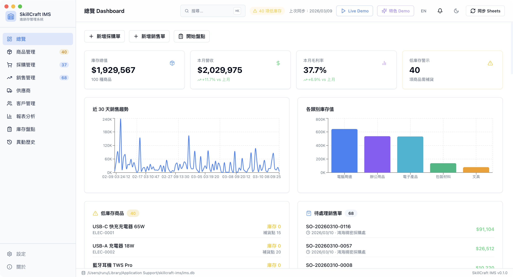
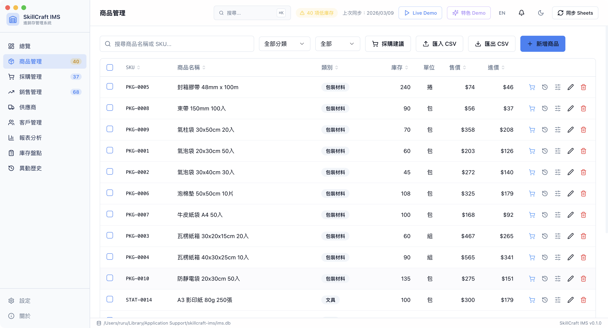
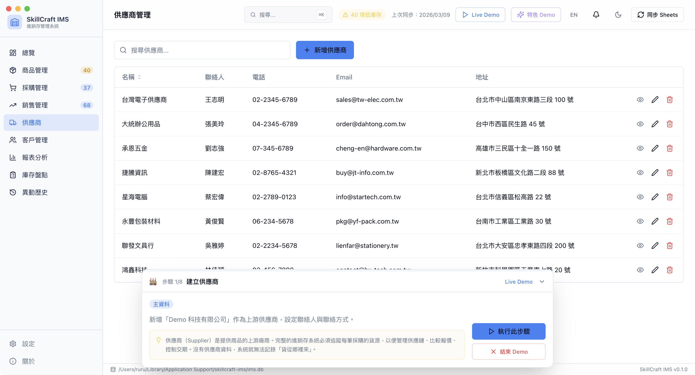
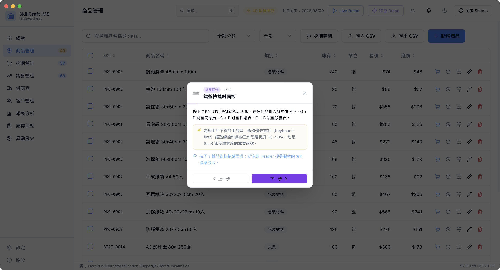
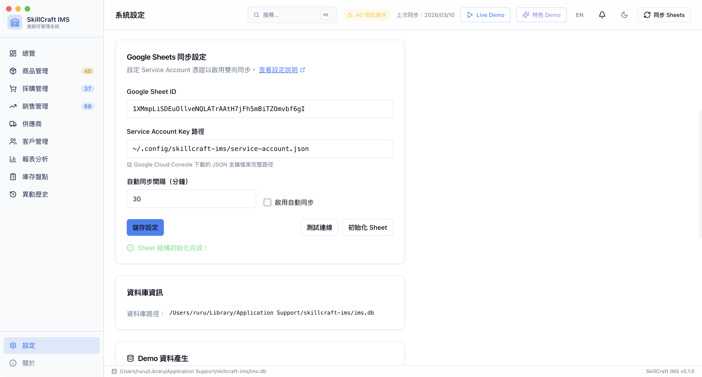
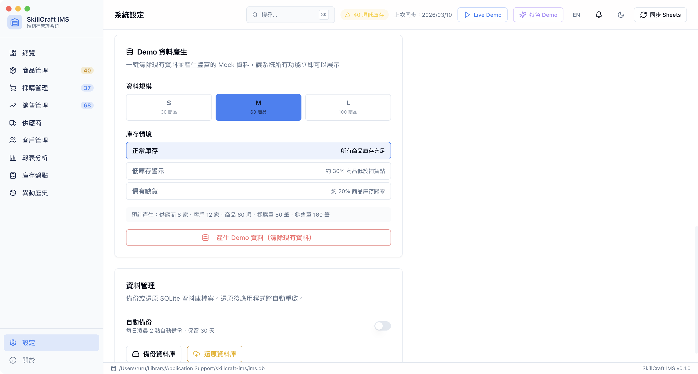
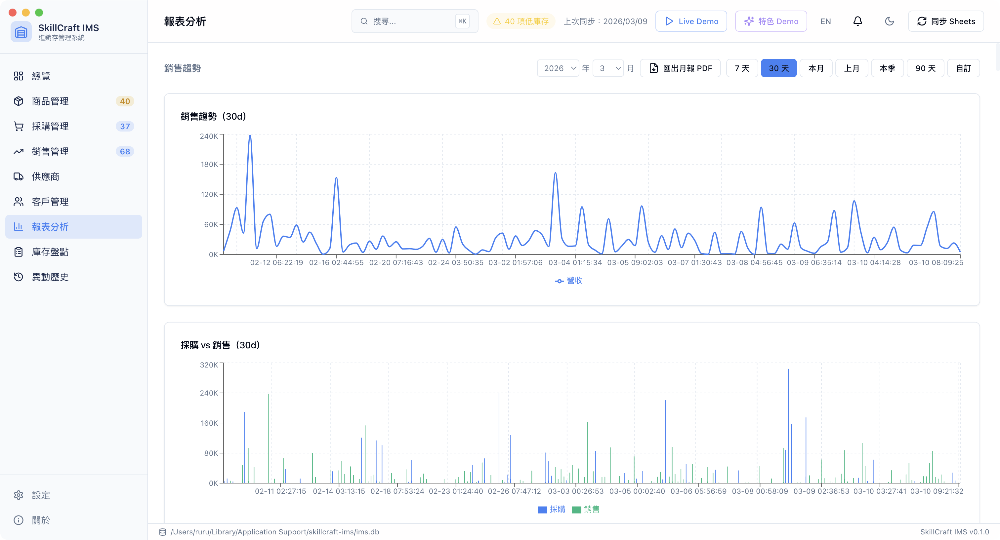

# SkillCraft IMS 進銷存管理系統

[](https://www.electronjs.org/)
[](https://react.dev/)
[](https://www.typescriptlang.org/)
[](https://www.sqlite.org/)
[](https://developers.google.com/sheets)
[](LICENSE)
[](https://github.com/swiftruru/skillcraft-ims/releases/latest)

> 跨平台桌面進銷存管理系統，以 **Claude Code Skill 規範驅動開發**，整合 Google Sheets 雲端同步，
> 展示「高等程式語言與軟體設計」課程三個核心方向的完整整合。

---

> ## 🔍 RAG（Retrieval-Augmented Generation）整合展示
>
> 本系統實作一個完整的進階 RAG 管線，並原生整合進桌面 App：
>
> | 步驟 | 說明 | 對應實作 |
> | --- | --- | --- |
> | **Step 1 Retrieval** | 從資料庫「擷取」相關業務資料 | Guard → Query Rewriting → Time Range Detection → **Query Expansion** → Entity Extraction → **Semantic Entity Fallback** → Adaptive SQLite 查詢 |
> | **Step 2 Augmented** | 將擷取的資料「增強」為 LLM 上下文 | Multi-model Routing（Haiku / Sonnet）+ **Adaptive Context Pruning** + 格式化 context 注入 system prompt + **結構化多輪摘要快取** |
> | **Step 3 Generation** | 呼叫 LLM「生成」自然語言回答 | Claude 串流輸出 + Faithfulness Scoring + Citation Attribution + Followup 建議持久化 |
>
> 開啟 AI 頁面 → **AI 問答** Tab，即可用中文自由提問你的進銷存資料。
> 每則回答均可展開「查看本次使用的業務資料」，觀察完整 Retrieval Context；引用來源以彩色徽章標注，多欄資料自動渲染為可排序表格。
> **品質分析** Tab 提供歷史忠實度分佈、模型使用比例、Guard 攔截率、近 7 天問答趨勢等 KPI 儀表板。

## 截圖

| Dashboard | 商品管理 |
| --- | --- |
|  |  |

| Live Demo | UX Tour |
| --- | --- |
|  |  |

| Google Sheets 同步設定 | Demo 資料產生 |
| --- | --- |
|  |  |



---

## 下載

| 平台 | 下載連結 |
| --- | --- |
| macOS (Apple Silicon / Intel) | [下載 .dmg](https://github.com/swiftruru/skillcraft-ims/releases/latest) |
| Windows (x64) | [下載 .exe](https://github.com/swiftruru/skillcraft-ims/releases/latest) |

> 所有版本：[github.com/swiftruru/skillcraft-ims/releases](https://github.com/swiftruru/skillcraft-ims/releases)

---

## 學術背景

- **課程名稱**：高等程式語言與軟體設計
- **指導老師**：陳彥宏（YEN-HUNG CHEN）老師
- **專案性質**：期末作業，整合課程提供的三個核心方向：
  1. **LLM SKILL 機制** — 以 Claude Code Skill 定義開發規範，AI 依規範參與程式碼生成（本專案核心亮點，詳見下方說明）
  2. **GitHub + Google Sheet** — GitHub Actions CI 流程 + Google Sheets API 雙向同步
  3. **桌面進銷存系統** — Electron 跨平台應用，完整的採購銷售庫存管理

---

## Claude Code Skills — AI 規範驅動開發

> **這是本專案最核心的設計理念。** 所有功能均以「先寫 SKILL 規範，再依規範實作」的流程完成，確保 AI 生成的程式碼始終符合專案架構與品質標準。

### 什麼是 Claude Code Skill？

Claude Code 的 **Skill 機制**允許開發者將程式設計規範嵌入開發流程。Skill 存放於 `.claude/commands/`，每個 Skill 檔案包含：

- **YAML frontmatter**：觸發條件描述（`description` 欄位）
- **規範內容**：具體的開發規則、命名規範、架構約束

當開發請求符合某個 Skill 的描述時，Claude Code **自動載入**對應規範，約束程式碼生成行為，無需開發者手動提醒。

### Skill 運作流程

```text
開發者提出需求（自然語言）
          │
          ▼
Claude Code 比對所有 Skill 的 description
          │
          ▼
自動載入匹配的 Skill（可同時載入多個）
          │
          ▼
依 Skill 規範生成符合專案架構的程式碼
          │
          ▼
TypeScript 型別檢查驗證（tsc --noEmit）
```

### 本專案 Skill 清單（20 個）

#### 開發規範 Skills（核心 10 個）

這些 Skill 定義了各層次的開發規則，確保 AI 生成的程式碼始終符合專案架構：

| Skill 檔案 | 觸發時機 | 規範重點 |
| --- | --- | --- |
| `ims-react.md` | 新增/修改 React 元件、表單、查詢 | React Query、react-hook-form + Zod、shadcn/ui、通知、鍵盤導覽 |
| `ims-sqlite.md` | 新增/修改 DB 操作、Model、Migration | Transaction 強制要求、WAL 模式、庫存保護邏輯 |
| `ims-ipc.md` | 新增/修改 IPC 功能、preload bridge | 三層同步原則、Channel 命名、禁止直接 import |
| `ims-inventory.md` | 進貨、銷售、庫存異動業務邏輯 | 不可逆狀態、Transaction 結構、庫存扣減驗證 |
| `ims-electron.md` | Electron 主程序、系統通知、原生 API、自動更新 | 通知格式、低庫存自動寫入 app_notifications、auto-update via GitHub Releases |
| `ims-report.md` | Dashboard、KPI 卡片、圖表、報表 | Recharts 規範、金額格式、React Query 快取 |
| `ims-receivables.md` | 帳款管理、帳齡分析、逾期追蹤 | 帳款 KPI、帳齡色段、到期提醒規範 |
| `ims-credit-limit.md` | 客戶 / 供應商信用額度 | 超額警示、信用進度條顯示規範 |
| `ims-payment-notify.md` | 帳期到期提醒、逾期通知 | Dashboard 警示卡片、7 天內到期 badge 規範 |
| `ims-ai.md` | AI 需求預測、Claude API 整合 | Haiku 模型、JSON prompt 規範、API Key 管理 |

#### 操作型 Skills（任務輔助 10 個）

這些 Skill 提供具體任務的執行指引：

| Skill 檔案 | 用途 |
| --- | --- |
| `ims-sync.md` | Google Sheets 雙向同步規範 |
| `sync-sheets.md` | 同步狀態查看、錯誤診斷、首次設定引導 |
| `ims-search.md` | 全域搜尋、Command Palette 規範 |
| `ims-export.md` | CSV 匯出規範 |
| `inventory-report.md` | 庫存分析報告生成 |
| `sales-analysis.md` | 銷售趨勢分析 |
| `reorder-alert.md` | 補貨量計算與採購建議 |
| `generate-mock-data.md` | 測試資料生成（含 in-app 一鍵產生） |
| `import-data.md` | CSV 批次匯入規範 |
| `ims-payment-notify.md` | 帳期到期提醒、逾期通知、Dashboard 警示卡片規範 |

### Skill 檔案格式範例

```markdown
---
name: ims-react
description: 當使用者要求新增或修改 React 元件、頁面、表單或資料查詢邏輯時觸發。
---

## React 開發規範

1. **資料查詢使用 React Query**：所有從 IPC 讀取資料的邏輯必須使用 `useQuery`，
   queryKey 格式為 `['domain']`，禁止在元件內直接 useEffect + useState 自行管理...

2. **資料變更使用 useMutation**：新增、更新、刪除操作必須使用 `useMutation`，
   onSuccess 時呼叫 queryClient.invalidateQueries...
```

### Skill 驅動開發實例

以「商品快速採購」功能為例，完整開發流程：

**步驟一**：先在 `ims-react.md` 新增規範（Rule 18）：

```markdown
18. **商品快速採購（Quick Purchase Dialog）**：Products 表格每行動作按鈕區新增「快速採購」按鈕...
    - 元件命名 QuickPurchaseDialog，位於 src/renderer/src/components/purchases/...
    - 送出呼叫 purchases:create，payload { supplier_id, order_date, items: [...] }
    - 成功後 invalidate(['purchases']) + toast success，關閉 dialog
```

**步驟二**：再依規範實作，Claude Code 自動套用 `ims-react`、`ims-ipc` 兩個 Skill，生成的程式碼符合：

- ✅ `useMutation` + `invalidateQueries` 模式
- ✅ 使用 shadcn/ui `<Select>` 元件
- ✅ 三層 IPC 同步（main handler → preload bridge → global.d.ts 型別）
- ✅ TypeScript 型別正確（`tsc --noEmit` 無錯誤）

> 完整 Skill 規範請參閱 [.claude/commands/](.claude/commands/)

---

## Google Sheets 設定

詳細步驟請參閱 [docs/google-cloud-setup.md](docs/google-cloud-setup.md)

快速摘要：

1. 建立 Google Cloud 專案並啟用 Sheets API
2. 建立 Service Account 並下載 JSON 金鑰
3. 建立 Google Sheet 並分享給 Service Account
4. 在 app 設定頁面填入 Sheet ID 和金鑰路徑（支援 `~` 展開，如 `~/.config/skillcraft-ims/service-account.json`）

---

## 功能特色

### 商品管理

- **完整 CRUD**：SKU、名稱、分類、售價、進價、庫存量、補貨點、單位、說明
- **商品圖片**：拖放上傳（最大 10 MB），表格縮圖顯示，詳情 Dialog 點擊放大預覽
- **進階篩選**：分類篩選 + 庫存狀態篩選（全部／低庫存／零庫存），任一條件啟用時顯示「清除篩選」
- **批次操作**：多選商品，浮動操作列支援「批次調整分類」、「批次調整售價 / 進價」、「批次設定補貨點」與「批次刪除」（有庫存的商品自動略過）
- **商品詳情**：雙 Tab 顯示「庫存異動歷史」（BarChart + 列表）與「採購價格歷史」（LineChart + 列表）
- **庫存調整**：任意調整庫存量，必填調整理由，完整記錄每次異動
- **快速採購**：每行有 `ShoppingCart` 按鈕，開啟迷你 Dialog 預填建議補貨量與進價，可選供應商，一鍵建立採購單
- **CSV 匯入**：支援 Excel 匯出的 UTF-8 BOM 格式，欄位自動對應（支援中英欄位名），SKU 衝突時 upsert，超過 50 筆自動備份資料庫
- **CSV 匯出**：一鍵匯出全部商品清單

### 採購管理

- **採購單 CRUD**：建立含多品項的採購單，指定供應商與採購日期、帳期（30 / 45 / 60 天）
- **訂單折扣**：每個品項可設定 `discount_pct`（0–100%），小計自動換算折後金額，詳情 Dialog 顯示折扣欄與折後小計
- **狀態工作流**：待處理 → 已收貨（自動更新庫存 + AVCO 成本）→ 已退貨；或 → 已取消
- **訂單詳情**：彈窗顯示品項明細（含折扣）與金額，底部水平時間軸呈現訂單生命週期；已收貨且未付款時顯示「標記已付款」按鈕
- **PDF 列印**：美化採購單，含公司標頭、品項表格、簽名欄
- **供應商詳情**：點擊供應商名稱開啟 Dialog，顯示聯絡資訊、信用額度進度條、採購統計、訂單歷史與**對帳單**（日期區間篩選 + 已付/未付金額統計）
- **採購建議**：Dashboard 及商品頁可一鍵開啟補貨建議 Dialog，自動計算建議補貨量

### 銷售管理

- **銷售單 CRUD**：建立含多品項的銷售單，指定客戶與帳期（30 / 45 / 60 天）
- **訂單折扣**：每個品項可設定 `discount_pct`（0–100%），小計自動換算折後金額，詳情 Dialog 顯示折扣欄與折後小計
- **狀態工作流**：待處理 → 已完成（事務性庫存扣除）/ 部分退貨 → 已退貨；或 → 已取消
- **信用額度警告**：建單時若客戶未付款金額超出信用上限，即時顯示黃色警告
- **即時庫存警示**：建單時若任一品項庫存不足，即時警示並阻止出貨
- **低庫存通知**：完成出貨後若有商品跌破補貨點，自動寫入通知中心並推送系統桌面通知（最多 5 項）
- **訂單詳情**：同採購，底部時間軸顯示建立 → 完成/取消 → 退貨；已完成且未付款時顯示「標記已付款」按鈕
- **PDF 列印**：美化銷售單，格式與採購單一致
- **客戶詳情**：點擊客戶名稱開啟 Dialog，顯示聯絡資訊、信用額度進度條、消費統計、訂單歷史與**對帳單**（日期區間篩選 + 已付/未付金額統計）

### 帳款管理

- **應收 / 應付帳款**：統一頁面切換，顯示所有已設定帳期的未付款項
- **帳齡分析**：將未付款項依逾期天數分為四色段卡片（未到期 / 逾期 1–30 天 / 31–60 天 / 60 天以上），金額加總一覽
- **即將到期提醒**：7 天內到期的帳款顯示琥珀色 badge；Dashboard 同步顯示「即將到期」警示卡片
- **逾期警示**：逾期未付帳款以紅色標示，Dashboard 顯示「逾期帳款」卡片並計入側邊欄徽章
- **一鍵標記付款**：直接在帳款頁或訂單詳情 Dialog 標記已付款，含二次確認

### 報表與分析

| 報表 | 說明 |
| --- | --- |
| KPI 卡片 | 庫存總值、本月營收（含月對月 % 增減）、毛利率、低庫存預警數、逾期帳款數 |
| 銷售趨勢 | 可選期間（7天/30天/本月/上月/本季/90天/自訂）的每日營收 LineChart |
| 採購 vs 銷售 | 同一期間採購金額（藍）vs 銷售金額（綠）分組 BarChart |
| 庫存分佈 | 各分類的商品數、庫存數量、庫存價值 BarChart |
| 銷售排行 | 指定天數內依營收排序的 Top Products |
| 毛利分析 | 各商品毛利率（以 AVCO 成本計算），≥30% 綠色、10–30% 黃色、<10% 紅色標示 |
| ABC 分析 | 依銷售額將商品分為 A / B / C 三級 |
| 損益表（P&L） | 指定期間的收入、成本、毛利一覽 |
| 供應商統計 | 各供應商採購次數、已收金額 |
| 客戶統計 | 各客戶訂單數、完成金額 |
| 業績排行 | Top 10 客戶 BarChart + 完整排名表 |
| 庫存週轉率 | 各商品售完天數預估，≤7天緊急補貨（紅）、≤30天留意（黃） |
| 停滯品分析 | 超過 30/60/90 天無出貨的商品，標示庫存價值 |
| 月報 PDF | 一鍵匯出指定月份的 PDF 月報（含 KPI、前 5 名商品、客戶、低庫存清單） |

### AI 需求預測

- **獨立功能頁面**：側邊欄獨立入口，完整呈現分析結果，不再受 Dashboard 空間限制
- **結果持久化**：預測結果存入本地 SQLite，重啟 App 或再次進入頁面仍保留上次結果，不需重複生成
- **套用建議補貨點**：結果頁面新增「套用建議補貨點」按鈕，一鍵將 AI 預測的 30 天需求量 × 50% 批次更新為各商品補貨點
- 設定頁面填入 Claude API Key 後啟用；分析近 30 天銷售資料，呼叫 **Claude Haiku** 模型產生需求預測
- 回傳整體趨勢摘要 + 各商品建議補貨量與原因（繁體中文）；預估售完天數 < 7 天以橘色醒目標示
- 每列可直接點擊「建立採購單」，跳轉至採購管理並自動開啟新增表單

### AI 問答（進階 RAG Pipeline）

開啟 AI 頁面 → **AI 問答** Tab，以中文自由提問你的即時進銷存資料。

#### RAG 管線架構

```text
使用者問題
    │
    ▼
[Pre-Retrieval Guard]  偵測與進銷存無關的問題，直接拒絕（含攔截訊息持久化）
    │
    ▼
[Query Rewriting]      改寫為精確查詢語句（與 Guard 合併為單次 LLM 呼叫）
    │
    ▼
[Time Range Detection] Regex 解析中文時間詞 → SQLite 日期條件（不消耗 Token）
    │
    ▼
[Entity Extraction]    Regex 擷取商品 / 客戶 / 供應商名稱，SQLite LIKE 解析為 ID
    │
    ▼
[Semantic Fallback]    LIKE 全部失配時，送 Haiku 比對實際實體清單（縮寫 / 別名 / 拼字相似）
                       成功對應後寫入 entity_aliases 快取，下次相同縮寫直接查表，不再呼叫 API
    │
    ▼
[Multi-model Routing]  Regex 判斷問題複雜度：簡單查詢 → Haiku，分析趨勢 → Sonnet
    │
    ▼
[Adaptive Retrieval]   依主題（庫存/銷售/客戶/供應商）+ 實體 ID 動態查詢 SQLite
    │
    ▼
[Context Pruning]      Context 超過 2,500 字元時，以 Haiku 剪裁至最相關條目
                       正常查詢不觸發（零額外消耗）；多主題 + 多實體大量命中時自動啟動
    │
    ▼
[Augmented Prompt]     查詢結果格式化為結構化 context 注入 system prompt
    │
    ▼
[Streaming Generation] Claude API 串流輸出，逐字即時顯示
    │
    ▼
[Faithfulness Scoring] 評分回答是否忠實於業務資料（0–100）
    │
    ▼
[Citation Attribution] 解析 [SOURCES:] 標記，產生彩色引用來源徽章
```

#### 功能特色

- **串流回答**：Claude API 逐字即時輸出，含閃爍游標動畫
- **多輪對話記憶**：Session 存入 SQLite，重啟 App 歷史保留；側邊欄可管理多個 Session
- **後續問題建議**：每則回答附帶 3 個 AI 生成的後續問題，點擊即送出；重新進入歷史 Session 時建議問題同樣顯示（持久化存入 DB）
- **引用來源標注**：每則回答以彩色徽章標注引用的資料來源（藍=庫存、綠=銷售、橘=客戶、黃=供應商）
- **多模型路由**：純查詢問題使用 Haiku（低成本），含分析/趨勢/比較的複雜問題自動升級 Sonnet；回應 metadata 列顯示使用的模型
- **實體擷取 + 語意消歧義**：自動識別問題中的商品/客戶/供應商名稱；LIKE 全部失配時啟動語意 fallback，以 Haiku 比對資料庫中的實際實體清單（支援縮寫、別名、拼字相似），對應結果持久化為 alias 快取，下次相同縮寫零 API 消耗直接命中
- **自適應 Context 剪裁**：擷取資料量過大時（> 2,500 字元），自動以 Haiku 剪裁至與問題最相關的條目，避免稀釋回答焦點與截斷生成；正常查詢不觸發，零額外 API 消耗
- **可排序互動表格**：AI 回答含有多欄比較資料時，自動渲染為可點擊欄位標題排序的互動式表格，附複製為 TSV 按鈕
- **忠實度評分**：每則回答顯示彩色分數徽章（綠 ≥90 / 黃 ≥70 / 紅 <70）與說明
- **Token 用量顯示**：顯示每次呼叫的 input / output token 消耗
- **提示詞防護**：非進銷存問題自動攔截，不執行 Retrieval、不消耗主要 Token；攔截訊息同樣存入 Session 歷史
- **錯誤重試**：API 失敗時顯示錯誤並附「重試」按鈕
- **Word 匯出**：對話記錄匯出為 `.docx`，Markdown 表格正確渲染為 Word 表格
- **動態高度**：聊天面板自動填滿視窗剩餘空間，輸入框不超出畫面
- **⌘/Ctrl+Enter 送出**，Enter 換行

### 庫存盤點

- **建立盤點單**：快照當下所有商品庫存量為「帳面數量」
- **逐品項填寫**：逐一輸入實際盤點數量，即時顯示差異
- **Mock 填入**：開發/展示用，一鍵填入與帳面相符的數量
- **完成盤點**：自動產生庫存異動記錄，將庫存修正至實際盤點值
- **差異視覺化**：已完成的盤點詳情頁自動顯示「差異分析」水平 BarChart，藍色為帳面數量、綠色為實際盤點，只呈現有差異的商品

### 庫存異動歷史

- 記錄所有庫存變動（採購入庫、銷售出貨、手動調整、盤點修正）
- 支援多條件篩選：關鍵字搜尋、異動原因、日期區間
- CSV 匯出

### 通知中心

- Header 鈴鐺圖示，未讀通知顯示紅色數字 badge（最多 99+）
- App 啟動時自動檢查低庫存並寫入通知（每日最多一筆，防止重複）
- Popover 展開最新 10 筆；點擊通知可跳轉相關頁面並標記已讀
- 「全部標為已讀」一鍵清除

### 智慧補貨

- **補貨建議卡片**（Dashboard）：自動列出低於補貨點的商品，勾選後一鍵建立採購單
- **低庫存桌面通知**：App 啟動時 + 確認出貨後，若商品庫存跌破補貨點，推送系統通知並寫入通知中心
- **每日庫存摘要**：每天 09:00 自動推送低庫存數量與待處理訂單

### PDF 文件列印

- **美化採購單 / 銷售單**：公司標頭（名稱、地址、電話）、彩色狀態標籤、斑馬紋表格、簽名欄
- **月報 PDF**：Reports 頁面指定月份後一鍵匯出
- **公司資訊設定**：在設定頁面填入後，自動帶入所有 PDF 文件

### 無障礙（Accessibility）

本專案依 WCAG 2.1 / 2.2 標準，系統性實作 99 項無障礙規則（詳見 `.claude/commands/ims-react.md`）：

- **鍵盤完整可操作**：所有表格支援 ↑↓ 鍵導覽、Enter 開啟詳情、Home/End 首末列；拖曳排序提供 ▲▼ 鍵盤替代按鈕
- **螢幕閱讀器支援**：`aria-sort`、`aria-busy`、`aria-invalid`、`aria-live` 公告區、`role="grid"` / `role="status"` 語意完整
- **表單無障礙**：所有表單欄位含 `aria-invalid` + `aria-describedby` 錯誤關聯，提交失敗時顯示錯誤摘要區塊
- **焦點管理**：Dialog 開啟後 focus 移至第一個輸入欄位，關閉後 focus 歸還至觸發按鈕；Skip Navigation 連結
- **視覺強化**：`prefers-reduced-motion` 停用動畫；`prefers-contrast: more` 提高對比；所有 icon-only 按鈕補 `aria-label`
- **系統主題整合**：跟隨 macOS / Windows 深淺色主題，`nativeTheme` 即時反應系統切換
- **HTML `lang` 動態切換**：語言切換時同步更新 `<html lang>`，螢幕閱讀器以正確語言口音朗讀

### Google Sheets 整合

- **雙向同步**（商品）：以 `updated_at` 時間戳決定版本，offline-first 設計
- **推送同步**（採購單、銷售單、每日報表快照）
- **自動排程**：可設定每 N 分鐘自動同步
- **Service Account 認證**：無需 OAuth2 流程，適合桌面應用

---

## Demo 展示功能

### Live Demo — 端對端互動展示

點擊 Header「Live Demo」按鈕，啟動一套完整的 **8 步驟業務流程模擬**，讓觀看者零資料就能體驗系統的核心操作：

| 步驟 | 操作 | 說明 |
| --- | --- | --- |
| 1 | 建立供應商 | 自動導覽至供應商頁，Typewriter 動畫逐字填入公司名稱、聯絡人、電話 |
| 2 | 建立客戶 | 同上，填入客戶資料 |
| 3 | 新增商品 | 自動填入 SKU、商品名、分類、售價、進價、庫存 |
| 4 | 建立採購單 | 選擇剛建立的供應商，加入商品品項，送出採購單 |
| 5 | 確認收貨 | Spotlight 高亮「確認收貨」按鈕，引導觀看者點擊，庫存自動增加 |
| 6 | 建立銷售單 | 選擇剛建立的客戶，加入品項，送出銷售單 |
| 7 | 完成出貨 | Spotlight 高亮「確認出貨」按鈕，庫存自動扣除 |
| 8 | 查看 Dashboard | 自動跳至首頁，展示 KPI 卡片、銷售趨勢圖、低庫存警示的即時更新 |

**Demo 互動機制：**

- **Typewriter 動畫**：表單欄位逐字打出，模擬真實填寫過程，讓觀看者能清楚追蹤每個輸入值
- **Spotlight 高亮**：需要使用者操作的按鈕以綠色脈動光圈標示，引導觀看者主動點擊
- **DemoController 浮動面板**：Demo 期間固定在畫面右下角，顯示目前步驟進度，可折疊、可隨時結束
- **資料保留**：結束後 Demo 資料保留於畫面供觀察；下次啟動 Live Demo 或重新開啟 App 時自動清除

### 特色功能導覽（UX Tour）

點擊 Header「特色導覽」按鈕（或 `Eye` 圖示），啟動 **12 個 UX 亮點的 Spotlight 導覽**，每個步驟附有設計解說，適合課程簡報或技術評審展示：

| # | 功能亮點 | 設計重點說明 |
| --- | --- | --- |
| 1 | 鍵盤快捷鍵面板（`?` 鍵） | Keyboard-first 設計讓熟練操作員效率提升 30–50% |
| 2 | 全域搜尋 Command Palette（`⌘K`） | 從「多層點擊」降至「兩次按鍵」的導覽成本 |
| 3 | 深淺色主題切換 | 夜班護眼 vs 日間展示的人體工學設計 |
| 4 | 低庫存紅/黃色警示 | Pre-attentive Attribute：2 秒內掃描到風險 |
| 5 | 快速採購一鍵補貨 | Path of Least Resistance：發現問題到採取行動一步完成 |
| 6 | 自動 SKU 號碼產生 | Automation with Control：自動產生但可手動覆寫 |
| 7 | 訂單一鍵複製 | 節省 70% 重複下單的輸入時間 |
| 8 | 日期區間篩選 | Progressive Disclosure：預設全部，需要時再縮範圍 |
| 9 | 逾期採購單橘色警示 | Proactive UX：主動計算等待天數，而非等用戶查找 |
| 10 | 報表自訂日期範圍 | 讓報表從「展示工具」進化為「決策工具」 |
| 11 | 通知中心 | 從 Reactive Tool 進化為 Proactive Assistant |
| 12 | 盤點差異長條圖 | 視覺化讓盤點結果從「數字回報」升級為「健康診斷」 |

每個步驟自動導覽至對應頁面，並以 Spotlight 光圈圈出目標元件，搭配浮動 Tooltip 說明 UX 設計原則，支援中英雙語切換。

### Demo 資料產生（設定頁面）

不想手動建資料就能展示完整功能？設定頁面的 **「Demo 資料產生」** 卡片可一鍵生成大量真實感資料：

**資料規模：**

| 規模 | 商品 | 採購單 | 銷售單 | 適合情境 |
| --- | --- | --- | --- | --- |
| S（小型） | 30 種商品 | 40 筆 | 80 筆 | 快速展示、功能確認 |
| M（中型，預設） | 60 種商品 | 80 筆 | 160 筆 | 課程簡報、一般 Demo |
| L（大型） | 100 種商品 | 150 筆 | 300 筆 | 壓力測試、報表視覺化 |

**庫存情境：**

| 情境 | 說明 |
| --- | --- |
| 正常庫存 | 所有商品庫存充足，適合展示完整採購銷售流程 |
| 低庫存警示 | 約 30% 商品低於補貨點，展示通知中心與補貨建議卡片 |
| 壓力測試 | 約 20% 商品庫存歸零，搭配大量資料展示系統穩定性 |

**生成內容：**

- 8 家供應商（含 40% 機率設定信用額度 50,000–200,000）+ 12 位客戶（含 30% 機率設定信用額度 30,000–100,000）
- 商品橫跨 5 大分類（電子零件 / 週邊設備 / 文具 / 包材 / 辦公用品），SKU 自動依類別前綴產生
- 訂單日期以二次方偏移分布（Quadratic Bias）產生，讓近期資料密度更高，符合真實業務節奏
- 每筆採購/銷售單含 1–4 個品項，價格與數量隨機浮動 ±15%
- 帳款情境保證生成：逾期銷售 3–5 筆、逾期採購 2–3 筆、7 天內到期 2–3 筆、今日到期 1 筆——確保帳款管理頁面開箱即有內容
- 銷售單狀態分布：65% 完成、5% 待處理、20% 已取消、7% 已退貨、3% 部分退貨
- 2–3 份已完成盤點 + 1 份草稿盤點，供庫存盤點功能展示差異圖表
- 自動產生庫存異動歷史記錄

> 點擊「一鍵產生」前會清除現有資料，執行後按 `⌘R`（Mac）/ `Ctrl+R`（Windows）重新整理即可看到效果。

---

## UX 設計細節

### 鍵盤操作

| 快捷鍵 | 功能 |
| --- | --- |
| `⌘K`（Mac）/ `Ctrl+K`（Windows） | 開啟全域搜尋（跨商品、供應商、客戶、訂單） |
| `?` | 開啟快捷鍵說明面板 |
| `Esc` | 關閉彈窗 / 快捷鍵面板 |
| `N`（在採購/銷售頁） | 開啟新增表單 |
| `G` → `H` | 導覽至首頁 Dashboard |
| `G` → `P` | 導覽至商品頁 |
| `G` → `B` | 導覽至採購頁 |
| `G` → `S` | 導覽至銷售頁 |
| `G` → `R` | 導覽至報表頁 |
| `G` → `,` | 導覽至設定頁 |
| ↑↓ | 表格列鍵盤導航（Enter 開啟詳情，Home/End 跳到首末列） |

> G+key 為兩鍵序列，按下 G 後 1.5 秒內按第二鍵即跳轉，類似 vim/GitHub 的導覽模式。
> **所有 G+key 快捷鍵均可在設定頁面自訂**，並於 Sidebar 導覽項目 hover 時顯示提示。

### 側邊欄狀態徽章

側邊欄導覽項目右側會即時顯示計數徽章：

- **商品**：低庫存數量（黃色），提醒需要補貨的品項數
- **採購**：待處理採購單數（主色），提醒尚未確認收貨的單數
- **銷售**：待處理銷售單數（主色），提醒尚未完成出貨的單數
- **帳款管理**：逾期未付帳款總筆數（紅色），提醒逾期應收 + 應付

### 其他 UX 細節

- **DataTable 分頁**：表格資料超過 15 筆時出現分頁列，顯示「第 X / Y 頁　共 N 筆」，支援中英切換
- **低庫存 badge 可點擊**：Header 低庫存數量徽章為連結，點擊直接跳至商品頁並自動套用「低庫存」篩選
- **訂單狀態時間軸**：採購單與銷售單詳情底部的水平步驟條，直觀呈現訂單生命週期
- **批次操作浮動列**：選取商品後從畫面底部滑入，不佔用常駐版面
- **清除篩選**：只要任一篩選條件非預設值，出現「清除篩選」連結，一鍵重置
- **深淺色主題**：記憶上次設定，重啟自動套用；跟隨系統主題（可在設定頁選擇）
- **中英切換**：Header 右上角一鍵切換繁體中文 / English，所有頁面即時更新
- **頂部導航進度條**：任何背景請求進行中時，畫面頂端顯示 2px 進度條動畫
- **頁面摘要列**：表格上方即時顯示當前資料的統計數字（總數、待處理數、金額等）
- **一鍵複製**：SKU、訂單號、聯絡資訊等欄位 hover 時顯示複製 icon，點擊後圖示切換確認
- **分類色彩系統**：商品分類 Badge 依名稱 hash 自動套用 6 色，讓不同分類視覺上更易區分
- **KPI 數字動畫**：Dashboard KPI 卡片數值載入時以 ease-out 曲線動畫到目標值
- **DataTable 密度切換**：表格行高三段可調（緊密 / 標準 / 寬鬆），設定存入 localStorage
- **自動更新**：設定頁面「關於與更新」卡片可手動檢查更新，有新版本時顯示下載進度，下載完成可一鍵安裝重啟

---

## 技術架構

```text
┌─────────────────────────────────────────────┐
│             Renderer (React 19)              │
│  Dashboard │ Products │ Purchases │ Sales    │
│  Reports │ StockTake │ InventoryHistory      │
│  Recharts 圖表 │ shadcn/ui 元件              │
│  TanStack Query │ Zustand │ react-hook-form  │
├─────────────────────────────────────────────┤
│         contextBridge (Type-Safe IPC)        │
│              src/preload/index.ts            │
├──────────────┬──────────────────────────────┤
│  Main Process│  Services                    │
│  better-sqlite3 │  GoogleSheetsService      │
│  IPC Handlers│  SyncService + node-cron     │
│  Electron    │  NotificationService         │
└──────────────┴──────────────────────────────┘
```

### 技術棧

| 層次 | 技術 |
| --- | --- |
| 桌面框架 | Electron 34 + electron-vite |
| 前端 | React 19 + TypeScript 5.7 + Vite |
| 樣式 | Tailwind CSS v3 + Radix UI (shadcn/ui) |
| 資料庫 | SQLite (better-sqlite3)，WAL 模式 |
| 雲端同步 | Google Sheets API v4 (Service Account) |
| 狀態管理 | Zustand (persist) + TanStack React Query v5 |
| 圖表 | Recharts |
| 表單 | react-hook-form + Zod |
| 排程 | node-cron |

---

## 快速開始

### 需求

- Node.js 20+
- Python 3.x（用於 better-sqlite3 編譯）

```bash
# 1. 安裝相依套件
npm install --ignore-scripts

# 2. 編譯 SQLite native module
npx @electron/rebuild -f -w better-sqlite3

# 3. 下載 Electron 執行檔（首次需要）
node node_modules/electron/install.js

# 4. 啟動開發模式
npm run dev
```

### 打包發佈

```bash
npm run package
# 輸出至 release/ 目錄
# macOS: release/*.dmg
# Windows: release/*.exe
```

---

## 專案結構

```text
skillcraft-ims/
├── .claude/
│   └── commands/            # Claude Code Skills（15 個）
│       ├── ims-react.md     # React 元件開發規範（19 條規則）
│       ├── ims-sqlite.md    # SQLite / Model 開發規範
│       ├── ims-ipc.md       # Electron IPC 開發規範
│       ├── ims-inventory.md # 庫存業務邏輯規範
│       ├── ims-electron.md  # Electron 主程序規範（通知等）
│       ├── ims-sync.md      # Google Sheets 同步規範
│       ├── ims-report.md    # 報表與 Dashboard 規範（15 條規則）
│       └── ...（其他操作型 Skills）
├── docs/                    # 文件
├── src/
│   ├── main/                # Electron 主程序（Node.js）
│   │   ├── db/              # SQLite 連線、migrations、models
│   │   ├── ipc/             # IPC handlers（products, purchases, sales,
│   │   │                    #   reports, stocktake, notifications, mockdata 等）
│   │   └── services/        # Google Sheets、同步、排程
│   ├── preload/             # contextBridge 安全橋接（型別同步）
│   └── renderer/            # React 應用
│       ├── src/pages/       # Dashboard, Products, Purchases, Sales,
│       │                    #   Reports, StockTake, InventoryHistory, Settings...
│       ├── src/components/  # UI 元件（含 QuickPurchaseDialog、DemoController 等）
│       │   └── demo/        # Live Demo、UX Tour、DemoFormOverlay
│       ├── src/stores/      # Zustand stores（theme, ui, demo, uxTour）
│       └── src/types/       # schema.ts + global.d.ts（型別三層同步）
└── resources/               # App 圖示
```

---

## 授權

MIT License — 詳見 [LICENSE](LICENSE)
